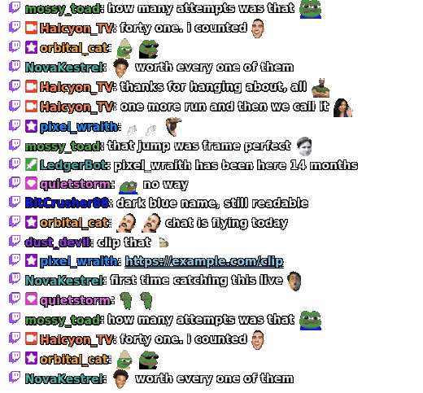
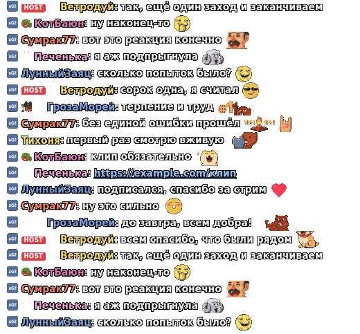
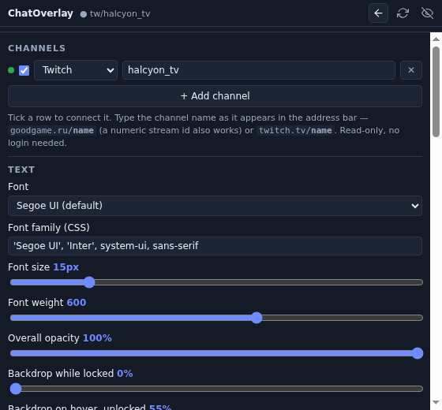

# ChatOverlay

Twitch, YouTube and GoodGame chat, on top of your game. Transparent,
click-through, read-only — no login, no tokens.

| Twitch | GoodGame |
|---|---|
|  |  |

Locked, that is all there is: no window, no background, no scrollbar. Clicks go
straight through to the game. Run several at once and they merge into one feed.

## Install

**[Download the latest release →](../../releases/latest)** — unzip, run
`ChatOverlay.exe`. Windows 10/11, 64-bit.

Nothing to install, no Node.js, no admin rights. Windows warns once that the exe
is not signed: **More info → Run anyway**.

## Add a channel

Settings → **+ Add channel** → pick the platform, type the name, tick it.

| Channel page | Type this |
|---|---|
| `twitch.tv/`**`somechannel`** | `somechannel` |
| `goodgame.ru/`**`somechannel`** | `somechannel` |
| `youtube.com/`**`@somechannel`** | `@somechannel` |

Saved instantly, restored next launch.

YouTube chat belongs to a stream rather than to a channel, so a YouTube row
connects while that channel is live and keeps checking while it is not — it
picks the stream up on its own when one starts, and says so in the feed
meanwhile. To pin one particular stream instead, paste its link.

## Controls

| | |
|---|---|
| `Ctrl`+`Alt`+`O` | lock / unlock — locked means click-through |
| `Ctrl`+`Alt`+`H` | hide / show |
| Drag the top bar | move it (unlock first) |
| Click a link in chat | opens it in your browser (unlock first) |
| Drag the bottom-right corner | resize it |
| Tray icon | the same, by mouse |

Unlocked, hovering the window fades a backdrop in so you can see its edges.
Locked, it vanishes again.



## What you get

- **Emotes** — Twitch native, 7TV, BetterTTV, FrankerFaceZ, GoodGame smiles,
  and YouTube's emoji and channel membership emoji.
- **Badges** — real Twitch artwork (mod, VIP, founder, sub tiers, bits),
  GoodGame's own chat icons, and YouTube membership badges. Moderators and
  channel owners get the same sword and camera whichever platform they are on,
  since only Twitch publishes a picture of those two.
- **Superchats and memberships** — a YouTube superchat reads as a chat line
  with the amount on it, in the tier colour YouTube gave it; new members,
  membership milestones and gifted memberships appear as they happen.
- **Nickname colours** exactly as the site shows them, or lifted for contrast
  over a bright game.
- **Any font** installed on your machine, any size.
- **Updates in-app** — about 35 KB, not another 137 MB.

## Make it yours

Settings → **Custom CSS**, applied as you type:

```css
/* tighter lines, lowercase names, bigger emotes */
.msg       { line-height: 1.15; }
.msg .name { text-transform: lowercase; }
.emote     { height: calc(var(--emote-size) * 1.4); }
```

```css
/* a subtle card behind every message */
.msg { background: rgba(0, 0, 0, .35); border-radius: 6px; padding: 2px 6px; }
```

```css
/* hide the platform logo and the timestamps */
.plat-img, .ts { display: none; }
```

Hooks: `.msg`, `.msg .name`, `.msg .text`, `.badge`, `.badge-img`, `.emote`,
`.plat-img`, `.msg.system`.

## Good to know

- Overlays only draw over **borderless / windowed** games. Exclusive fullscreen
  hides every overlay, this one included.
- A quiet channel looks like a broken app. It usually is not.
- Settings live in `%APPDATA%\ChatOverlay\config.json` — delete it to reset.
- Chat is read-only; the overlay cannot send messages.

## Build it yourself

```bash
npm install
npm run check        # typecheck, unit tests at 100%, end-to-end
./build.sh --zip     # dist/ChatOverlay.zip
```

Runs on Linux, WSL or macOS — no Windows machine, no wine.

Contributing: [CLAUDE.md](CLAUDE.md). History: [CHANGELOG.md](CHANGELOG.md).

## Licence

MIT. Twitch, YouTube and GoodGame names, logos and badge artwork belong to
their owners.
